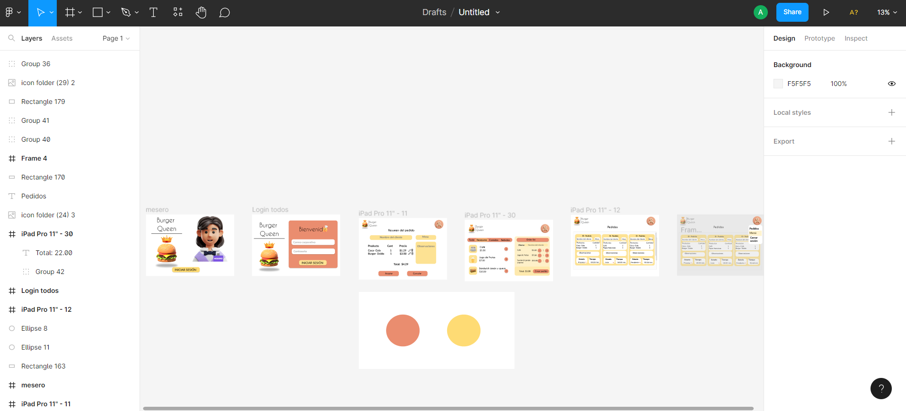
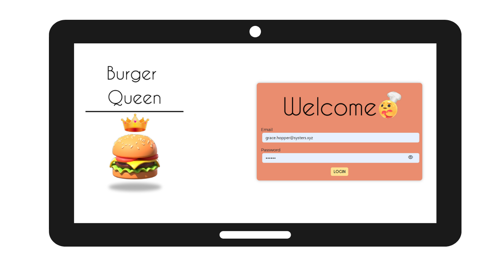
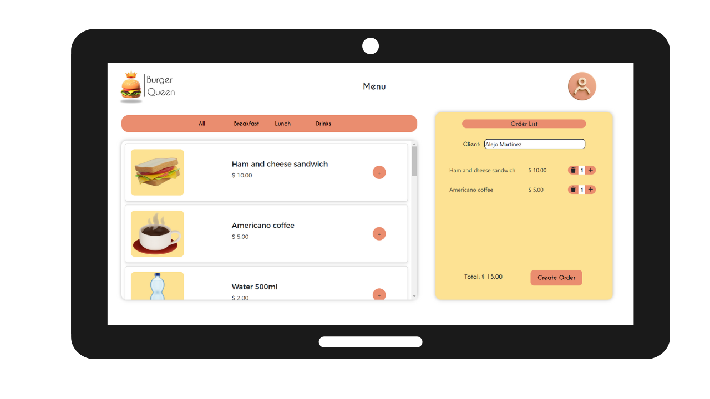
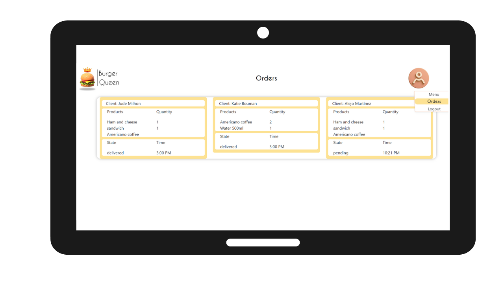
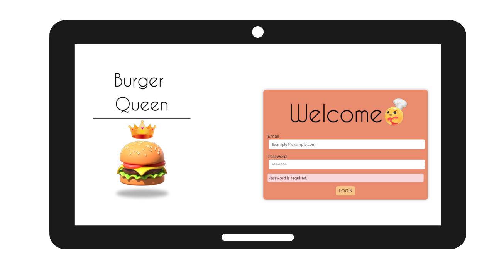

# Burger Queen (API Client)

## 1. Project Overview 

Burger Queen API Client is an application developed with [Angular](https://angular.io/), through which, burger restaurant waiters can see the menu, take orders through a Tablet and send them to the kitchen to be prepared in an orderly and efficient way, solving the same problem: how to keep the interface and state synchronized.
This project has two areas: interface (client) and API (server).

🍔You can test the App by clicking [here](https://dev-003-burger-queen-api-client-tau.vercel.app/):
   👩🏻‍🍳User: grace.hopper@systers.xyz
   🔎Password: 123456

🍔Mock for Burger Queen API [here](https://github.com/angieli13/burger-queen-api-mock)

## 2. Prototype in figma

## 3. Project images
"User story 1": Waiter should be able to login to the system, if the admin has already assigned him/her credentials.

[User story 2] Waiter should be able to see all the products in the menu or by categories, he/she can also create orders with the customer's name, increase and decrease products or delete, finally see the total and be able to create orders.

[User story 3] Waiter through the hamburger menu can go to orders and see time and status of orders.

[User story 4] Waiter through the hamburger menu can go back to the menu and log out.
